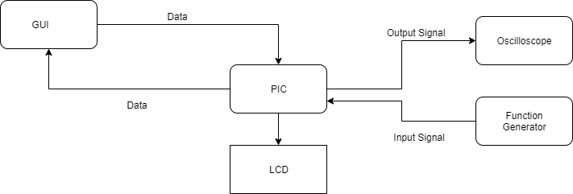
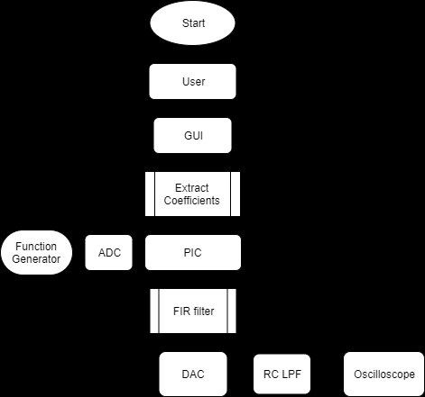

# Real-Time-Digital-Filter-and-C-GUI-Control
Disclamer: This project is done as Midterm project for ECE 422- Microcontroller System Design @ St.Cloud State University in Fall 2019.

Development of a real-time digital signal processing system that uses PIC24FV16KM202 and C# GUI to digitize analog signal using a Low Pass Filter
(LPF )or a Band Pass Filter(BPF) using FDATOOL of Matlab. The system processes the digitized data using a digital filter implemented in the
PIC24 and C# GUI is used to select a filter file and download the file to the PIC24.

This project provides user with options to choose LPF and BPF to extract 100, 200 and 300 Hz signal from input 100 Hz square wave signal. 
Input signal is digitized using 8-bit ADC and processed using 16-bit coefficients from FDA tool of MATLAB and output is generated using 
8-bit DAC. Also, user can choose different sampling frequency and enter wide range of offset and shift value to control output from the 
system. Moreover, users are provided with GUI program developed in C# which helps user to easily control the system and visualize the 
output in the GUI. 

The system consists of LCD, Bluetooth Module, PIC24FV16KM202 microcontroller. The system is controlled by GUI developed using C#.
User can select two different types of filter i.e. LPF and BPF to extract 100 Hz, 200 Hz, and 300 Hz sinusoidal signals out of 100 Hz 
input square wave signal. Also, users can choose 3 different sampling frequency 1KHz, 1,5 KHz and 3 KHz to change the quality of output
signal and filter design. Input signal can have amplitude starting from 200 mV to 5V. However, depending upon the amplitude, it should 
have proper offset so that signal is positive. Offset for output signal is controllable by user entering values between 0-128. 
Also, its amplitude can be controlled using shift value provided by user. Implemented digital filters are FIR filter having 16-bit
coefficients. Filter coefficients are downloaded onto PIC system through serial from GUI. Moreover 16-bit coefficients are read from
files stored in the same folder as the GUI application. Maximum sampling frequency achievable by our system is also displayed in the 
GUI as per user request. There are separate buttons to control start and stop of sampling process. Also, there is a button to plot the
sampled and processed data on the GUI by receiving 100 samples from PIC. Moreover, RC lowpass filter having 322 Hz cut-off frequency is 
used to smooth out the output signal.   

